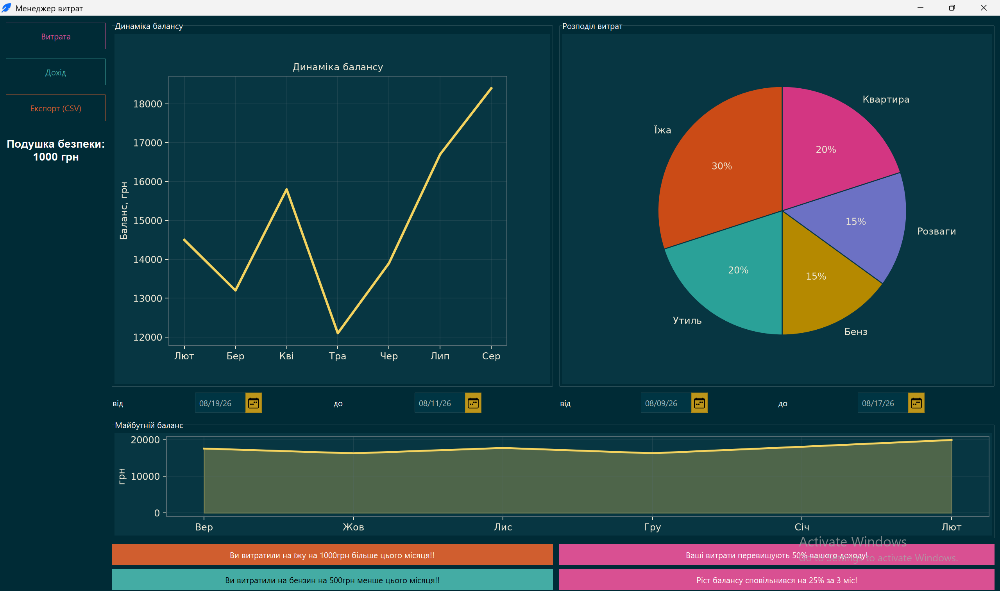

# Менеджер витрат



Навчальний графічний застосунок для перегляду динаміки балансу, розподілу витрат та прогнозу балансу. Інтерфейс створено за допомогою `ttkbootstrap`, а графіки — `matplotlib`.

## Вимоги

- Python 3.10 або новіший
- `pip`
- Git, якщо проєкт потрібно клонувати з GitHub

## Встановлення

Склонуйте репозиторій та перейдіть до папки проєкту:

```powershell
git clone https://github.com/IllyaHavrulyk/PythonFinalProject.git
cd PythonFinalProject
```

## Створення віртуального середовища

Віртуальне середовище зберігає залежності проєкту окремо від інших Python-проєктів.

### Windows PowerShell

```powershell
py -m venv .venv
.\.venv\Scripts\Activate.ps1
```

Якщо PowerShell блокує активацію, тимчасо дозвольте запуск скриптів лише для поточного вікна:

```powershell
Set-ExecutionPolicy -Scope Process -ExecutionPolicy Bypass
.\.venv\Scripts\Activate.ps1
```

### Windows Command Prompt

```bat
py -m venv .venv
.venv\Scripts\activate.bat
```

### Linux або macOS

```bash
python3 -m venv .venv
source .venv/bin/activate
```

Після активації на початку рядка термінала має з’явитися `(.venv)`.

## Встановлення залежностей

В активованому віртуальному середовищі виконайте:

```bash
python -m pip install --upgrade pip
python -m pip install ttkbootstrap matplotlib numpy
```

## Запуск

```bash
python main.py
```

Після запуску відкриється головне вікно менеджера витрат.

## Завершення роботи

Щоб вийти з віртуального середовища, виконайте:

```bash
deactivate
```

## Можлива проблема в Linux

Якщо з’являється помилка про відсутній `tkinter`, встановіть його засобами вашого дистрибутива. Наприклад, для Ubuntu/Debian:

```bash
sudo apt install python3-tk
```
